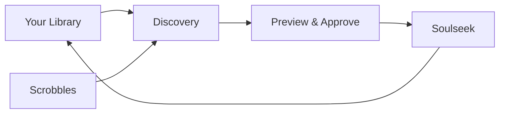

# Resonance

[](https://opensource.org/licenses/Apache-2.0)
[](https://ghcr.io/jordojordo/resonance)

**Discover music from your listening habits, preview before downloading, auto-fetch via Soulseek.**

https://github.com/user-attachments/assets/8e33838e-a73d-4489-9b72-44cdd9ec8d99

## Features

- **Multi-source discovery** — ListenBrainz recommendations + Last.fm similar artists
- **30-second audio previews** — Listen before you approve (via Deezer/Spotify)
- **Unified approval queue** — Review all recommendations with cover art and metadata
- **Automatic Soulseek downloads** — Integrates with slskd for P2P music fetching
- **Library-aware duplicate detection** — Checks your existing library to avoid re-downloading
- **Single Docker container** — Everything runs in one image



## Quick Start

### Prerequisites

- Docker and Docker Compose
- [slskd](https://github.com/slskd/slskd) running with API enabled
- [Navidrome](https://www.navidrome.org/) or compatible music server (for catalog discovery)
- [ListenBrainz](https://listenbrainz.org/) account + [Last.fm API key](https://www.last.fm/api/account/create)

### 1. Create configuration

```bash
mkdir -p resonance/data && cd resonance
```

Create `config.yaml`:

```yaml
listenbrainz:
  username: "your_username"

slskd:
  host: "http://slskd:5030"
  api_key: "your_api_key"

catalog_discovery:
  enabled: true
  navidrome:
    host: "http://navidrome:4533"
    username: "your_username"
    password: "your_password"
  lastfm:
    api_key: "your_lastfm_api_key"

ui:
  auth:
    enabled: true
    username: "admin"
    password: "changeme"
```

See [examples/config.yaml](examples/config.yaml) for all options.

### 2. Run with Docker Compose

Create `docker-compose.yaml`:

```yaml
services:
  resonance:
    image: ghcr.io/jordojordo/resonance:latest
    container_name: resonance
    volumes:
      - ./config.yaml:/config/config.yaml:rw
      - ./data:/data
    ports:
      - "8080:8080"
    restart: unless-stopped
```

```bash
docker compose up -d
```

### 3. Access the UI

Open `http://localhost:8080` and log in with your configured credentials.

## Documentation

[Configuration](docs/configuration.md) | [API](docs/api.md) | [Architecture](docs/architecture.md) | [Authelia Integration](docs/authelia-integration.md)

## Development

```bash
git clone https://github.com/jordojordo/resonance.git && cd resonance
pnpm install && pnpm dev  # Starts on http://localhost:5173
```

See [CONTRIBUTING.md](CONTRIBUTING.md) for guidelines.

## Related Projects

- [slskd](https://github.com/slskd/slskd) — Modern Soulseek client
- [Navidrome](https://www.navidrome.org/) — Music streaming server
- [ListenBrainz](https://listenbrainz.org/) — Open music listening data
- [Lidarr](https://lidarr.audio/) — Music collection manager (alternative approach)

## License

Apache License 2.0 — See [LICENSE](LICENSE) for details.

## Acknowledgments

Built with [ListenBrainz](https://listenbrainz.org/), [MusicBrainz](https://musicbrainz.org/), [Last.fm](https://www.last.fm/), and [slskd](https://github.com/slskd/slskd).
